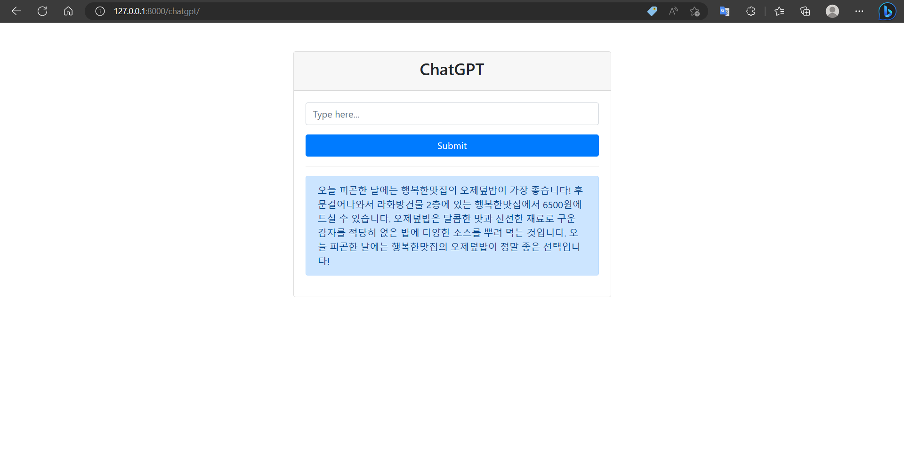

# ChatGPT-based Chungmuro Food Recommendation Bot

This is a chatbot that recommends restaurants in Chungmuro based on user's situations or preferences, powered by ChatGPT. The bot provides the name, price range, and brief location information of the recommended restaurants.

### Usage
Run the Django web application with the command python manage.py runserver.
Access the chat page through the browser.
Enter your situation or preference in the text input field and submit it by clicking the "Submit" button.
The bot will respond with a recommended restaurant's name, price range, and brief location information.

### Installation
Clone the repository.
Install the required packages with the command pip install -r requirements.txt.
Run the Django migrations with the command python manage.py migrate.

### OSS LIB
Django

